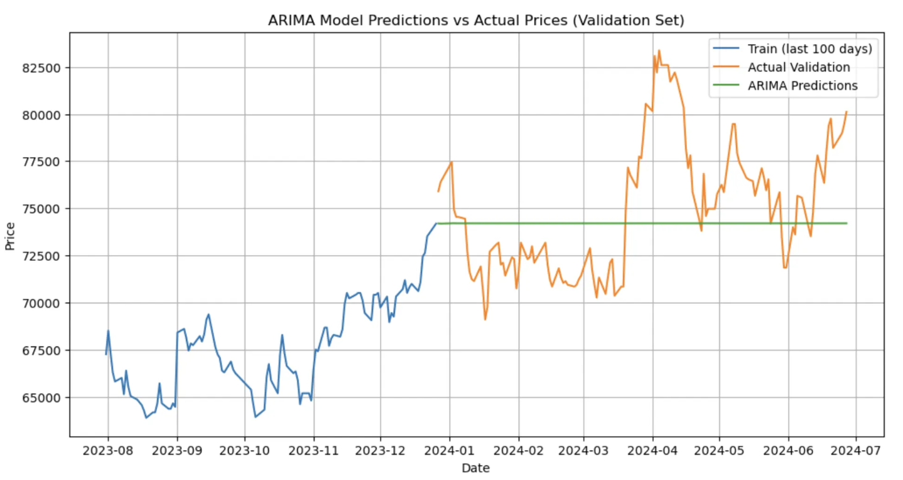
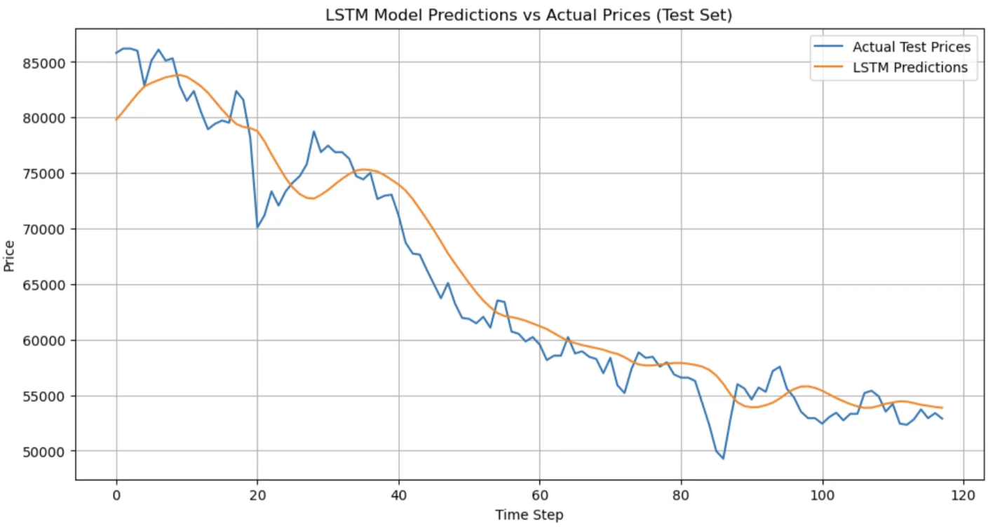

# 📈 Samsung Electronics Stock Forecasting (005930.KS)

This project analyzes and forecasts the stock price of **Samsung Electronics** using both classical time series models (ARIMA) and deep learning (LSTM). The project demonstrates an end-to-end financial time series pipeline — from data acquisition and preprocessing to forecasting and performance evaluation.

---

## 📌 Objectives

- Collect and visualize 5 years of historical stock data
- Test for stationarity and apply differencing if needed
- Train and evaluate ARIMA and LSTM forecasting models
- Compare model performance using RMSE and actual price alignment

---

## 🧰 Tech Stack

| Purpose         | Stack / Library                         |
|------------------|------------------------------------------|
| Language         | Python 3.x                               |
| Data Collection  | `yfinance`                               |
| Data Handling    | `pandas`, `numpy`                        |
| Time Series      | `statsmodels` (ARIMA), `tensorflow` (LSTM) |
| Visualization    | `matplotlib`, `seaborn`      |
| Preprocessing    | `MinMaxScaler`, differencing             |
| Evaluation       | RMSE, time-based validation split        |

---

## 📊 Dataset

- **Ticker**: `005930.KS` (Samsung Electronics)
- **Source**: Yahoo Finance
- **Date Range**: 2020-01-01 to 2025-01-01
- **Fields**: `Open`, `High`, `Low`, `Close`, `Adj Close`, `Volume`

---

## 🔍 Key Steps

### 1. Data Collection & Exploration
```python
import yfinance as yf
df = yf.download("005930.KS", start="2020-01-01", end="2025-01-01")
````

* Visualized closing price trends
* Identified high volatility during 2024

---

### 2. ARIMA Modeling

* Conducted **ADF Test**, **ACF/PACF Analysis**
* Configured ARIMA(5, 1, 0)
* Trained on final portion of training set
* Forecasted validation range (early 2024)

#### 🔎 Results

* RMSE: \~3549 KRW
* Failed to capture volatility
* Underfit the sharp uptrends and downtrends



---

### 3. LSTM Modeling

* Scaled data using `MinMaxScaler`
* Generated sequential input (60-day rolling window)
* Built 2-layer LSTM model using Keras
* Evaluated on same validation range

#### 🔎 Results

* Better RMSE than ARIMA
* More dynamic response to market swings
* Tracked peaks and valleys with higher fidelity



---

## 📈 Comparative Visualization

| Metric           | ARIMA        | LSTM                  |
| ---------------- | ------------ | --------------------- |
| RMSE             | \~3549 KRW   | (lower than ARIMA)    |
| Shape            | Flat, smooth | Noisy, more realistic |
| Volatility Match | Poor         | Good                  |
| Interpretability | High         | Moderate              |

> 🧠 ARIMA is useful for understanding linear components, but LSTM is better at adapting to nonlinear, volatile markets.

---

## 🧭 Key Learnings

* Financial time series often exhibit **non-stationarity and volatility**, challenging classical models like ARIMA.
* LSTM's ability to learn **nonlinear temporal dependencies** makes it more suitable in high-variance scenarios.
* Preprocessing (scaling, differencing) is crucial in both paradigms.
* Even poorly performing models are valuable for **benchmarking** and model comparison.

---
## 🧑‍💻 Author

> Maintained by Jihyeon Park
> Tech blog: [https://aeolian-stranger-f37.notion.site/Forecasting-Samsung-Electronics-Stock-with-ARIMA-and-LSTM-005930-KS-20a6eded231080f2a64fc11de85b74c3?source=copy_link]
